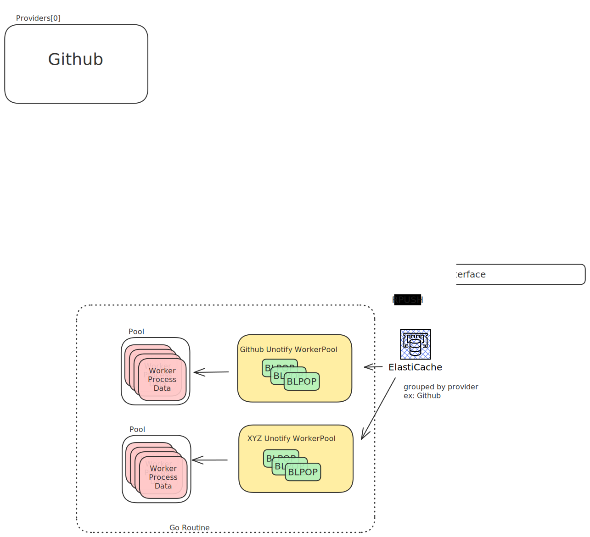

### Requirements:

- go v1.21+
- redis

**Document Generation**

- protoc
- protoc-gen-go
- protobuf


**Deployment Support Bundle**:

- terraform 
- aws account


**Worker**

Worker deployed with `bash` script. Has to be moved to `kubernetes`.


### Deployment:

```shell
AWS_ACCOUNT="" ./infraa/build/ecs.sh
```

```shell
cd infraa/deploy && AWS_ACCOUNT="" make run
```


### Integration

**Register Your hook**:

```shell
POST /conduit/webhooks/register HTTP/1.1
Content-Type: application/json
User-Agent: insomnia/8.6.1
Host: localhost:9091
Content-Length: 150

{
	"provider": "github",
	"repo_path": "go-batteries/webhook-test-repo",
	"repo_id": "webhook-test-repo"
}
```

This returns, a `secret` and `uri`. The secret can't be retrieved back. And can
only be regerated.


```json
{
	"success": true,
	"data": {
		"secret": "s-secret",
		"uri": "/webhooks/:provider/:repo_id/payload"
	}
}
```

**Github Integration**

- Copy the `secret`
- construct the url as `https://${your_domain}/${.response.data.uri}`
- Go to Webhook settings in github, and the the values.


### Whatisthis

<div style="height: 200px">

    

</div>


### Considerations:

- **Jira** Project names **should not have dash** in **project names**.
    - Allowed: DEV_OPS, DEVOPS, DEV$OPS, etc
    - NotAllowed: DEV-OPS
    - you can, but, it won't work. So better not. Will try to change it
      sometime.
- Storage layer is `redis` for now.
- This helps to have a publish subscribe with redis, but we also need storage.
  So it does publish subscribe, but with `RPUSH` and `BLPOP`
- Also it uses the same redis, to keep track of registered webhook information.
- For state transitions in `Jira`, it needs a `state id`. Which we need to fetch
  nad keep in application memory with 1 day exipry. This also could move to
  `redis`, incase the number of projects grow too large.
- The endpoint url for different projects can be like,
  `/webhook/provider/:repo/payload`, that way for github, the base
  functionality can remain same.
- The `:repo` above is just an unique identifier. Since within a github org, the
  repo names are unique, so that would be a good default, if it doesn't have
  emojis in it.

Each `Hook` has to implement a `Validate` method. Wether to validate or not,
depends on the provider.

**Example**:

Github allows setting a secret key when the webhook is created from their UI.
(For this requirement we only need `Releases`). So github uses this secret to
generate a `X-Hub-Signature-256`, which is sent in header. 

This value can be validated, by calculating the request body's signature, as
[mentioned by github](https://docs.github.com/en/webhooks/using-webhooks/validating-webhook-deliveries#examples).


In most cases, you will have _a single webhook endpoint per repository, served
by a single endpoint_ . Reason being it gets harder/tricker to validate secrets
if a single endpoint had multiple hooks, encrypted with different keys. We don't
want that sort of complexity.


